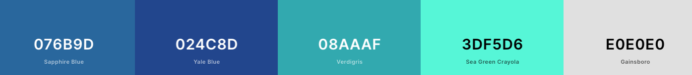
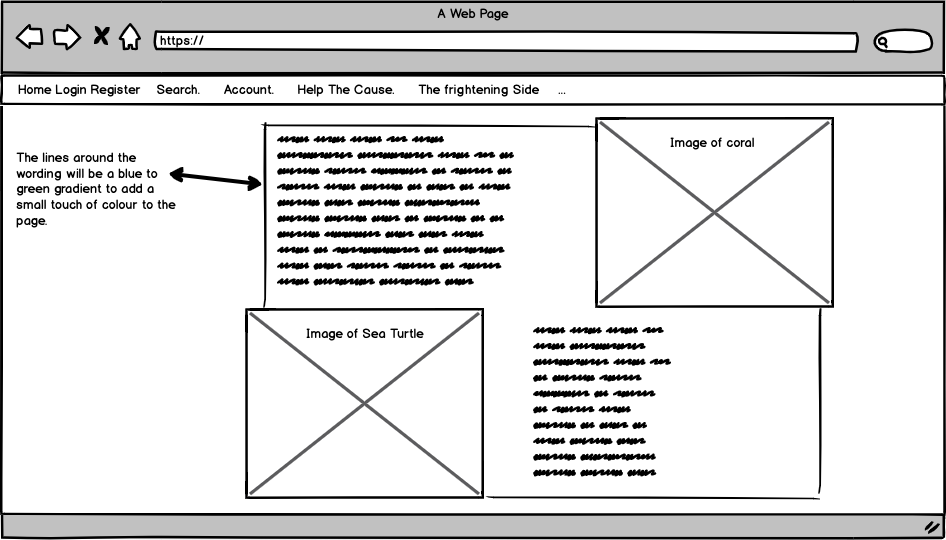
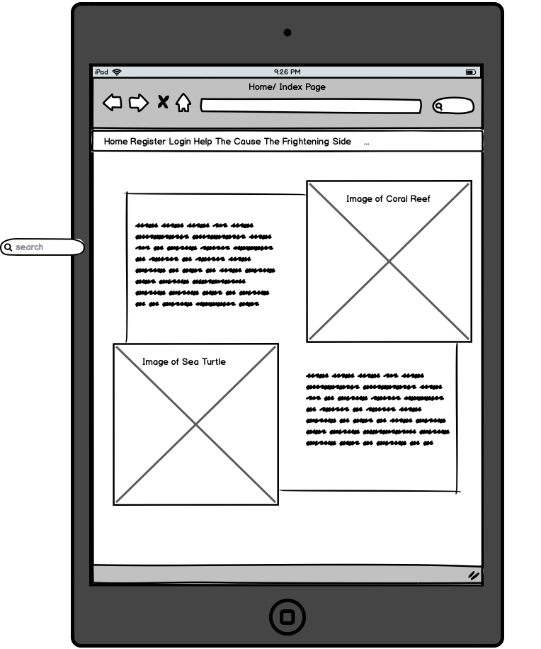
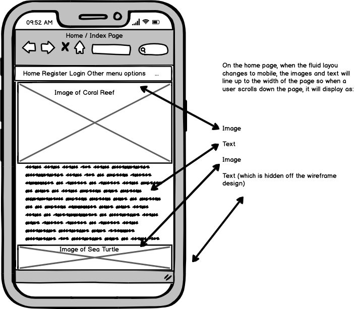

Envirosea

Envirosea is a website dedicated to preserving our oceans and helping to save all marine life. This is something we must do in vain
to help the future of the planet or it will die. The oceans provide the planet with so many resources and without it, the world has 
no chance of life. The greatest killer of the sea is plastic. Plastic has been around since the 19 and its uses have grown and grown 
to become one of the most common materials in life. It's not a natural material, not a natural resource but it's everywhere and the
frightening fact behind it is, it doesn't work with the rest of the planet. It kills the planet. This man made material can not be 
broken down, it will not go away on it's own for thousands of years. It just sits there and helps to kill all of the natural resources
of the planet. Envirosea has been designed to showcase what plastic is doing to our oceans. What it's killing and how it's going to take
an absolutely huge cleanup to reverse it's affects. We need to stamp out plastic all over the planet. We can see what it's doing on land.
We can see the affect on land, we can gather up the plastics and work out what to do with it. In the ocean, it's a hidden killer and we
need to change this. Welcome to the Envirosea Project.

## Contents

### 1. UX

* [Project Design](#Project-Design)
* [User Objects](#User-Objects)
* [Developers Objects](#Developers-Objects)
* [User Stories](#User-Stories)
* [Wireframes](#Original-wireframe-concepts)
* [Deployment](#Deployment)
* [Testing](#Testing-and-Bugs)

### 2. Features

### 2. Features

* [Site Features](#Site-Features)
* [Future Plans](#Future-plans)

### 3. Technologies Used 

* [Technologies Used](#Technologies-Used)

### Project Functionailty of Envirosea. 

The Envirosea application is a full-stack built project built using business logic to create a central databsae created using SQL.
It using Django Frameworks as the main backbone of the project but also incoroprates HTML, CSS and JavaScript for design purposes.
It has CRUD technology built in so a user can update their information and this will transfer to the dataset at the backend. It's 
a fully functional site using all elements of Full Stack to create a fully designed project. Defensive design has also been used for
a users protection and so Registration and Login are two key factors of the site. This protects the users data entries and is a secure
way of protecting the information they add to the database. As well as the software used for designing the various elements, the Heroku
platform is also used to create an online portal to the user. New changes to the site are controlled using Git and GitHub commanmds to
push information to Heroku. Secret Keys are also used and I have included .env files and .gitignore to stop essential security data
from being accessible to an outside user. To enhance layout and responsive fluidity on the site, Bootstrap is also used as part of the 
design of the project as it's such a great resource. 

### UX (User Experience)

### User Stories

* As a user. The site must:

1. Be designed with high importance and finished to a high standard for the user. Good design and functionailty are core within the project.

2. Have easy to use registration and login features. I also want to be able to use the purchasing system with ease and not get errors when
using the shopping features of the site.

3. Have good information to help me learn what the site is about. What information does Envirosea provide and how does it engage with me. 

4. Not be hard to use. I don't want the site to have broken elements or cause me levels of uncertainty when purchasing. Security and Defensive
design must be well thought out and of a high standard.

5. Get through to me. This site should help me see what we're doing to our planet. How can I change it and if I have to see something which 
may cause me discomfort, it is all part of the project.

* For me as a developer. Creating this site has:

1. Really opened my eyes to the amazing work that can be created with a heavy duty framework. Django as the next logical step from Python is
clever, well built and robust and showcases what can be achieved as a full stack developer.

2. Made me think more about the environment, what we're doing and what can we do to help. I want a user to feel the same and to use this 
site to help re-shape the future of our ocenas and the planet.

3. Hopefully started something. I want the site to grow a following and to help the ongoing fight of protecting all marine life. We can't 
ignore what we're doing and I want to be able make a difference and using the internet and this site is a good place to start.

4. Helped me to understnad more about the state of the world. I hope this site becomes a reality and people can learn and help develop changes
to fight the threat of plastics and prevent more danger to our oceans.

### User and Project Goals

I would also like users:

### User Objects

* Envirosea has been designed for the soul purpose of changing the planet. As a life support to Earth, we must protect our oceans. 97% of
the worlds water is held by the ocean and provides us with so much. It regulates our climate, absorbs CO2 and provides us with sustainable
resources. My goal is for this to become a mainstream site and help change the planet.

* Aimed at everyone to help the cause
* Informative and helpful to understand the changes we need to make
* Easy to use
* Well designed
* Engaging
* A good strong layout with colour choices
* Well thought out Content

### Developer Objects

* A well thought out user experience with crisp clean design
* A professionally designed site which utilises all functional requests required by the project
* A strong backend showing understanding of the framework and all other programming languages used
* The strength of the site will help to focus a users attention on the dangers of plastics in the ocean

## Project Design

* When I design a project, I feel the strength of an image can say a great deal. They can bring joy, bring back a memory and
we always find something within an image. An image can also be added to shock and to bring realisation but not in a cruel
or vicious way. I understand the term ignorance can be used for all elements of cruelty but in this instance, the way I'm using
ignorance is to show the devastation of plastics in the ocean and the realisation of what it's doing. There are shocking images 
as explained but there are also beautiful images and videos of the stunning animals and plantlife that the ocean's give us. 

* In all colour palettes, there are pairings that work well together. Red and black, Black and white or orange and grey. Simple
colours that can add more to a design then on their own. I've chosen a theme of predominantly blue and white. Blue to focus and tie
in with the colour of the ocean and white because it's clean. A grey font colour sits nicely between the two and stands out nicely
on the pages. The images themsleves, frightening and stunning showcase the changes we need to make. The videos are all from vimeo
and help to aid the design of the site.

* My wireframes have a general layout for the pages and the inital template for my design. There are also concept images which I've
drawn in Gravit designer. I looked at other sites with a similar theme to get an understanding of what my design would benefit from.
Going in to this with fresh eyes, I was able to pick out things I believed would work and put together a design that looked good on 
all screen sizes.

### Colours 

The colour palette below displays the core content colours of the site. Based around an aqua design colour palette, I feel This
contains the overall colour choices of the site.

  

### images

* The images I've chosen for the site are used to show the destruction of the oceans but... on the other side, there are the images
which show the pure wonder and the beauty of the sea. I feel that if someone is going to use this website as an informative source
of our oceans disaster areas, it needs to show whats happening and what we're fighting for.

* We are lucky that talented photographers dive into the depths of the ocean and take high definition photos of marine life.
Those photographs can showcase stunning colour, light and allow us to enjoy some truly amazing colours of fish and plants. 
But, we also have to see the other side and so my images are used to show everything that the site needs to say. This is to aid the 
realisation of what we're fighting for.

### Font's Used

### Wireframes and concept drawings

  

  

  

### Technologies Used

* Python
* HTML
* CSS
* JavaScript

### Frameworks and Libraries

* Django
* Flask
* [Bootstrap](https://getbootstrap.com/docs/4.3/getting-started/introduction/
* [Google Fonts](https://fonts.google.com/) 
* [Favicons](https://www.favicon.cc/)
* [Github](https://www.github.com)
* [Heroku](https://www.heroku.com)

### Registration and Login added for security and defensive design

The MS4 website application is required to have defensive design added so a can enter secure information. Secure information
such as credit card information and address details. Because they'll be entering such details, they must have peace of mind
that their data is secure.

The Django Allauth application was installed and added to the settings.py file which included authentication to secure users login
when accessing the database (Build on this)

### Media and Content

* The images were searched and found on Google

* All content was written by myself.

### Software Deployment and Software Cloning Technologies Used:

* This project was developed using the GitPod IDE (Integrated Development Environment) software. The data was then pushed to GitHub also using the GitPod IDE.

* The project was regularly pushed to the GitHub repository  and published to GitHub and Heroku pages using GitPod commands. Please read the guides below.

* First, I used the following as pre made template base for my site provided by Code Institute: 

GitHub Full Template Used as part of the process including software extensions for GitPod [Gitpod-Full-Template](https://github.com/Code-Institute-Org/gitpod-full-template)

### Deployment to Github

### When deploying Envirosea from the [GitHub repository], I used the following process:

### Deployment

### To run the project locally

* To run this project within your own IDE such as GitPod, Visual Studio or PyCharm, you'll need the following installed on your machine as they are necessary tools needed for the sites creation:

[PIP](https://pip.pypa.io/en/stable/installing/) Is a standard package management system used to install and manage software packages specifically written in Python.

[Python3 (Mine is MAC SPECIFIC)](https://www.python.org/downloads/mac-osx/) Prerequisites for installing Python3 on MAC

[Git](https://gist.github.com/derhuerst/1b15ff4652a867391f03)

 * You're MONGO_URI is specific to YOUR site, to create your own, read the MongoDB Atlas documenation [Found Here](https://docs.atlas.mongodb.com/)

 1. Open the GitHub dashboard and locate the repository

2. Under repository name, select the "Clone or download" green button located to the right of the page.

3. Select the "clipboard icon" on the right hand side of the page to copy the URL of the clone.

4. In your own IDE, open a terminal window.

5. Change the current working directory to your location of choice where you'd like the directory to be made.

6. Paste your Git URL which you copied and click "OK".

7. Then Press Enter and your local clone will be created.

8. You mauy need to upgrade pip locally with:

pip install --upgrade pip

To install all required modules, use the command

pip -r requirements.txt.

9. In your local IDE create a file called .env (environment variables file)

Inside the .env file, create a SECRET_KEY variable and a MONGO_URI to link to your own database. Please make sure to call your database Envirosea.

10. To run the application, use the command

python app.py

Then, you can visit the website at http://127.0.0.1:5000

### Back to Heroku Deployment (Windows Deployment is different and explained within the course)

To deploy Envirosea to Heroku, I used a Linux based system as I have an Apple MacBook Pro laptop.

1. I had to download and install the Heroku CLI software and run: brew install heroku from the command line. This makes it easier to create and manage the Heroku application direct from the command line.

2. I had to create a requirement.txt file using a terminal command: pip freeze > requirements.txt.

3. Then, I had to add to create a Procfile using the following command: echo web: python app.py > Procfile.

4. I then had to push the files to GitHub. git add (Enter) git commit (Named commit) which adds the requirements and Procfile to GitHub. Then using the git push command, it updates to my GitHub repository.

## The next stage pushing to Heroku

### We know the commits push to GirHub but I need the commits I make to reflect within Heroku and so to do this, I have to create a new Heroku application by doing the following.

1. Create an account and log into the Heroku website. Then, Create a new app by clicking the "New" button in the dashboard. You need to name the application so I gave mine the same name as the application I'm creating and then set the region to Europe.

2. On the Heroku dashboard, you'll see Deploy. You need to click on "Deploy" > "Deployment method" and select Github. 

3. Confirm the linking of the Heroku app to the correct GitHub repository. This ties the two applications together.

4. Once done, you'll need to add the settings to tie Heroku in with Github, the application you are building and the Mongo DataBase you have created. So, first from the Heroku dashboard of the applcation, click on "Settings"> "Reveal Config Vars"

5. Set the config vars as follows:

| Key     | Value |
| ----------- | ----------- |
| DEBUG  | FALSE       |
| IP   | 0.0.0.0     |
| MONGO_URI  | mongodb+srv:/<username>:<password>@<cluster_name>-qtxun.mongodb.net/            <database_name>?retryWrites=true&w=majority      |
| PORT  | 5000        |
| SECRET_KEY  | <your_secret_key>     |

 6. Back in the Heroku dashboard, click the "Deploy" button.

 7. In the Manual Deployment section of the page, make sure you have the master branch selected. Now click "Deploy Branch".

 8. Your site has now been deployed successfully.

full stack based project using business logic. The front end 

In this project, you'll build a full-stack site based around business logic used to control a centrally-owned dataset. 
You will set up an authentication mechanism and provide paid access to the site's data and/or other activities based on
 the dataset, such as the purchase of a product/service.

Value provided:
By authenticating on the site and paying for some of its services, users can advance their own goals. Before authenticating, 
the site makes it clear how those goals would be furthered by the site. The site owner is able to make money by providing this 
set of services to the users. There is no way for a regular user to bypass the site's mechanisms and derive all of the value 
available to paid users without paying.